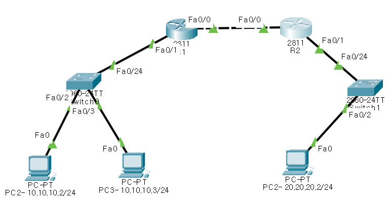
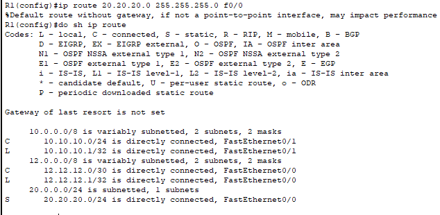

## **라우터 (Router)**

- **역할:** 서로 다른 네트워크 간에 데이터를 전송하며, 주로 LAN과 WAN(Wide Area Network)을 연결하는 데 사용됩니다.
- **포트:** LAN 포트 외에도 원거리 통신을 위한 WAN 포트를 가지고 있습니다.

### 2. 라우터 명령어 및 인터페이스

- **IP 통신 인터페이스 정보 확인 명령어:**

    ```bash
    Router>show ip int brief
    ```

    - **설명:** 이 명령어는 라우터의 모든 IP 인터페이스의 상태를 요약하여 보여줍니다.
- **Serial 인터페이스 명명 규칙:**
    - `serial 1/0`: 여기서 `1`은 슬롯 번호, `0`은 포트 번호를 의미합니다.

### 3. 라우팅 테이블과 네트워크 정보

- **라우팅 테이블의 필요성:**
    - 라우터는 네트워크 간의 데이터를 전송하기 위해 각 네트워크의 경로 정보를 가지고 있어야 합니다. 이러한 정보는 라우팅 테이블에 저장됩니다.

### 4. 라우터 메모리 구성 요소

- **RAM (Random Access Memory):**
    - 역할: 운영 중인 라우터의 현재 상태 및 데이터 저장. 라우터 부팅 시 Flash 메모리에 저장된 IOS(Internetwork Operating System) 이미지를 로드합니다.
- **NVRAM (Non-Volatile RAM):**
    - 역할: 라우터 설정 파일을 저장. 전원이 꺼져도 데이터가 유지됩니다.
- **ROM (Read-Only Memory):**
    - 역할: 라우터의 초기 부팅 시 필수적인 기본적인 소프트웨어를 포함하며, 트러블슈팅에 사용됩니다.

### 5. 라우터 설정 예시

- **R1 라우터 설정:**
    ```bash
    en
    conf t
    hostname R1
    no ip domain-lookup
    !
    int f0/1
    ip add 10.10.10.1 255.255.255.0
    no shut
    int f0/0
    ip add 12.12.12.1 255.255.255.252
    no shut
    ```

- **R2 라우터 설정:**

    ```bash
    en
    conf t
    hostname R2
    no ip domain-lookup
    !
    int f0/1
    ip add 20.20.20.1 255.255.255.0
    no sh
    int f0/0
    ip add 12.12.12.2 255.255.255.252
    no sh
    ```


### 6. 설정 저장 및 검증

- **설정 저장 명령어:**
    - 설정을 저장하려면 `copy running-config startup-config` 명령어를 사용하여 현재 설정을 NVRAM에 저장합니다.
- **라우팅 테이블 검증:**
    - 라우팅 테이블을 확인하려면 `show ip route` 명령어를 사용합니다.

### 7. 네트워크 정보 전달 방법

- **Static Routing (정적 라우팅):**
    - **설명:** 관리자가 수동으로 라우터에 경로 정보를 입력하는 방식입니다. 이 방식은 소규모 네트워크에 적합하지만, 대규모 네트워크에서는 비효율적일 수 있습니다.

    ```bash
    Router(config) ip route 20.20.20.0 255.255.255.0 12.12.12.2
    ```


### 8. 가상 라우터 (Virtual Router)

- **가상 라우터 개념:**
    - **설명:** 물리적인 하드웨어 장비가 아닌 소프트웨어적으로 구현된 라우터입니다. 서버에 설치되어 물리적 라우터와 동일한 기능을 수행하며, 가상 환경에서 유연하게 네트워크를 관리할 수 있습니다.