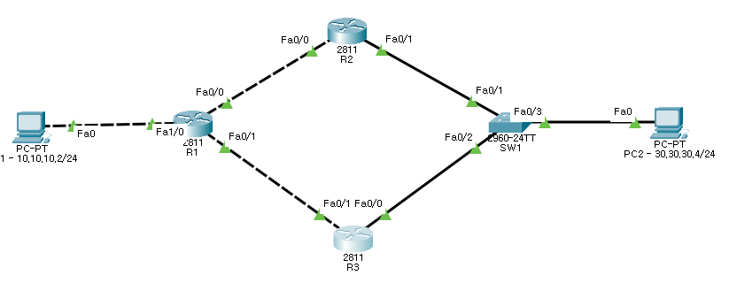

### 라우팅 테이블과 "Floating Static" 라우트 개념

라우터는 각 네트워크로의 최적의 경로를 라우팅 테이블에 저장합니다. 이 라우팅 테이블은 패킷을 최적의 경로로 전달하기 위해 사용되며, 각 경로는 메트릭(metric)에 따라 우선순위를 가지게 됩니다.

**Floating Static** 라우트는 기본 경로가 실패했을 때 사용될 백업 경로를 설정하는 메커니즘입니다. 즉, 기본 경로가 살아있는 동안에는 이 경로가 라우팅 테이블에 나타나지 않지만, 기본 경로가 실패하면 차순위로 설정된 경로가 라우팅 테이블에 올라옵니다. 이는 예비 경로로 설정된 정적(static) 경로로서, 메트릭 값을 높게 설정하여 주 경로보다 낮은 우선순위를 가지도록 합니다.



### 라우터 주소 설정

각 라우터(R1, R2, R3)의 인터페이스에 IP 주소를 설정하여 서로 연결된 네트워크를 구성합니다.

```bash
# R1
en
conf t
hostname R1
no ip domain-lo
!
line vty 0 4
pass cisco
!
int f1/0
ip add 10.10.10.1 255.255.255.0
no sh
int f0/0
ip add 172.16.12.1 255.255.255.0
no sh
int f0/1
ip add 172.16.13.1 255.255.255.0
no sh
```

```bash
# R2
en
conf t
hostname R2
no ip domain-lo
!
line vty 0 4
pass cisco
!
int f0/0
ip add 172.16.12.2 255.255.255.0
no sh
int f0/1
ip add 30.30.30.2 255.255.255.0
no sh
```

```bash
# R3
en
conf t
hostname R3
no ip domain-lo
!
line vty 0 4
pass cisco
!
int f0/1
ip add 172.16.13.2 255.255.255.0
no sh
int f0/0
ip add 30.30.30.3 255.255.255.0
no sh
```

### 원격 라우팅 테이블 추가

각 라우터에서 원격 네트워크로의 경로를 정적 라우트(static route)로 추가합니다. R1에서 두 개의 경로를 추가한 것은 앞서 설명한 "Floating Static" 라우트의 예시입니다. 주 경로로 설정된 R2의 인터페이스가 다운되면, 자동으로 R3을 통해 패킷이 전달되도록 구성되었습니다.

```bash
# R1

ip route 30.30.30.0 255.255.255.0 172.16.12.2  # 주 경로
ip route 30.30.30.0 255.255.255.0 172.16.13.2  # 백업 경로 (floating static)

# R2
ip route 10.10.10.0 255.255.255.0 172.16.12.1

# R3
ip route 10.10.10.0 255.255.255.0 172.16.13.1
```

### 라우팅 테이블 확인

라우팅 테이블을 확인하기 위해 `show ip route` 명령어를 사용하여 설정된 경로를 확인할 수 있습니다. 이 명령어를 사용하면 현재 활성화된 경로들만 확인할 수 있으며, "Floating Static" 경로는 주 경로가 실패하기 전까지 라우팅 테이블에 나타나지 않습니다.

```bash
R1# show ip route
```

위 명령어를 실행하여 R1에서 현재 활성화된 경로를 확인할 수 있습니다. 주 경로가 비활성화되면, 백업 경로가 라우팅 테이블에 추가되는 것을 확인할 수 있습니다.