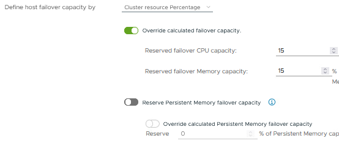
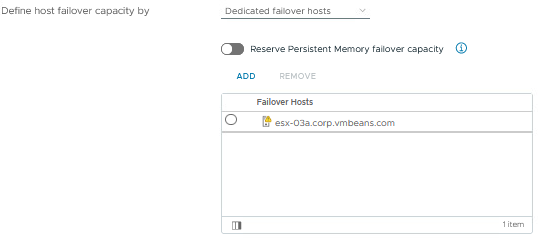
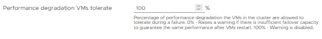

Host failures cluster tolerates

- **정의**: 이 설정은 클러스터 내에서 허용할 수 있는 호스트 장애의 최대 수를 정의합니다. 예를 들어, "2"로 설정하면 클러스터가 최대 2개의 호스트 장애를 견딜 수 있습니다.
- **용도**: 클러스터 내에서 호스트 장애가 발생했을 때 가상 머신을 다른 호스트로 이동시킬 수 있도록 필요한 리소스를 예약합니다. 이를 통해 호스트가 실패하더라도 가상 머신이 계속 작동할 수 있도록 보장합니다.
- **장점**:
    - **가용성 보장**: 호스트 장애가 발생해도 가상 머신이 지속적으로 실행될 수 있도록 리소스를 보장합니다.
    - **자원 최적화**: 클러스터의 자원을 효율적으로 활용하여 장애 발생 시 자원 부족 문제를 방지합니다.
- **주의사항**:
    - 너무 높은 호스트 장애 수를 설정하면 클러스터의 자원이 낭비될 수 있습니다. 필요한 가용성을 보장하면서도 자원 낭비를 최소화하는 균형을 찾는 것이 중요합니다.

Define host failover capacity by

- Cluster resource Percentage

- Slot Policy(powered-on VMs)
.png)

- Dedicated failover hosts

Perfomance degradation VMs tolerate

- **정의**: 이 설정은 장애 발생 시 가상 머신이 감수할 수 있는 성능 저하의 비율을 설정합니다. 예를 들어, 20%로 설정하면, 클러스터는 최대 20%의 성능 저하를 허용할 수 있도록 자원을 조정합니다.
- **용도**: 이 비율을 통해 장애 발생 시 가상 머신의 성능 저하를 어느 정도까지 허용할 수 있는지를 조정합니다. 이를 통해 클러스터의 자원 활용을 최적화하고, 성능 저하를 제어합니다.
- **장점**:
    - **고가용성 보장**: 장애 발생 시 성능 저하를 감수할 수 있는 비율을 설정함으로써, 클러스터는 장애 상황에서도 가상 머신이 계속 실행될 수 있도록 보장합니다.
    - **장애 허용**: 호스트 장애 발생 시 가상 머신의 성능 저하를 허용함으로써, 자원 할당의 유연성을 높이고, 클러스터의 장애 허용 능력을 강화합니다.
    - **유연한 리소스 관리**: 성능 저하를 허용하는 비율을 조정하여 자원의 사용을 최적화할 수 있지만, 이 설정의 주요 목적은 성능과 자원 관리보다는 고가용성을 유지하는 것입니다.
- **주의사항**:
    - 성능 저하 비율이 너무 높으면 가상 머신의 성능이 심각하게 저하될 수 있습니다.
    - 비율이 너무 낮으면, 자원을 과도하게 예약하여 클러스터의 자원 활용이 비효율적일 수 있습니다.