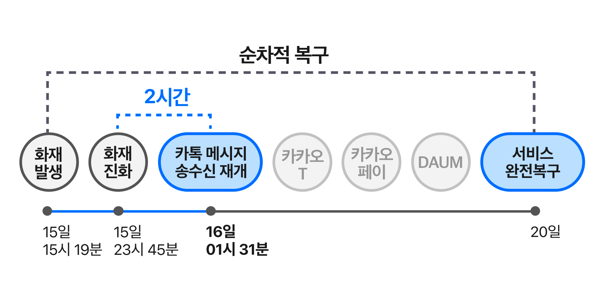

# Kakao화재 Case study

### 사건 개요

- 2022년 10월 15일 오후 3시 19분, SK C&C 판교 데이터센터에서 리튬이온배터리 화재가 발생하여 카카오의 여러 서비스에 장애가 발생했습니다. 화재 진압 후 약 2시간 뒤 카카오톡 메시지 송수신이 재개되었으나, 모든 서비스의 복구에는 약 5일이 소요되었습니다.

### 원인 분석

1. **데이터 센터 간 이중화 미흡**: 판교 데이터센터에만 이중화된 시스템들이 있어 다른 데이터센터로의 이중화 전환이 원활하게 이루어지지 않았습니다. 이는 카카오 인증 시스템과 주요 인프라에서 문제가 되었습니다.
2. **이중화 시스템의 자동화 부족**: 이중화 전환과 트래픽 제어가 자동으로 이루어지지 않고 수동 대응이 필요했습니다. 모니터링 시스템이 충분하지 않아, 여러 시스템에서 문제가 동시에 발생할 때 자동 전환이 실패했습니다.
3. **운영 관리 도구 복구 인력 부족**: 서비스 복구에 필요한 도구 복구 인력이 부족했고, 긴급 이중화 대응 장비 배치 공간이 부족하여 위기 대응이 지연되었습니다.

### 관련된 VMware기능
#### VMware Live Recovery
- **통합 관리 경험**: VMware Live Recovery는 랜섬웨어 및 재해 복구를 단일 관리 인터페이스에서 통합 관리할 수 있도록 하여, 
- 복구 절차를 간소화하고, 라이선스 유연성을 제공합니다.

- **사이버 복구 기능**: 가상 머신(VM)과 데이터를 보호하기 위해 고급 데이터 복원력을 제공하며, 
- 복구 시점 선택, 스냅샷 관리, 그리고 격리된 복구 환경에서의 행동 분석 테스트를 통해 랜섬웨어 감염을 차단합니다.

- **자동화된 재해 복구**: VMware Live Site Recovery 기능을 통해 중앙화된 복구 계획을 자동으로 실행하고, 
- 비즈니스 연속성을 유지할 수 있습니다. 이는 다양한 복제 기술과 통합되어 복구 목표 시간(RTO)과 복구 시점 목표(RPO)를 충족시키며, 모든 가상화된 애플리케이션의 복구를 지원합니다.

- **유연한 라이선스 모델**: 단일 구독 모델을 통해 다양한 사용 사례와 클라우드 환경에서의 복구를 지원하며, 고객이 필요에 따라 기능을 확장할 수 있습니다.
### Reference
https://www.kakaocorp.com/page/detail/9902

