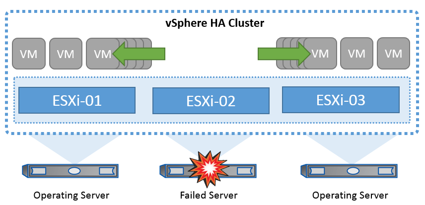
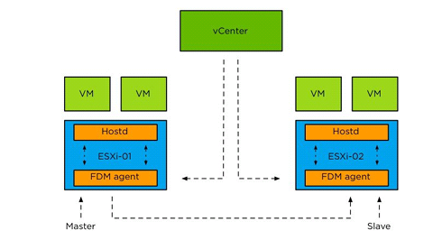

# vSphere HA Concept

- 클러스터에서 HA기능이 활성화 된 경우에는 ESXi 서버는 다른 호스트와 통신을 유지하여 ESXi호스트가 응답하지 않거나
격리될 경우 HAHA 클러스터는 클러스터의 남은 호스트 간에 해당 ESXi 호스트에서 실행 중이었던 가상 머신의 복구를 협상할 수 있습니다.
- 게스트 운영 체제에 장애 발생시 영향을 받는 가상 머신을 동잃나 물리적 서버에서 다시 시작합니다.
- 결과 계획된 다운타임을 줄이고, 예기치 않은 다운타임을 방지하며, 운영 중단으로부터 신속하게 복구가 가능합니다.

**네트워크 하트비트:** 네트워크 시스템 간의 연결 상태를 모니터링하기 위해 사용되는 신호 또는 메시지를 의미합니다. 이 개념은 주로 네트워크 장비나 서버 간의 연결 상태를 주기적으로 확인하여, 시스템이 정상적으로 작동하고 있는지 여부를 판단하는 데 사용됩니다.

### 호스트 장애 감지
HA 클러스터가 생성되면 클러스터의 모든 호스트가 선택에 참여하며 호스트 중 하나가 마스터가 됩니다. 각 슬레이브는 네트워크 하트비트를 마스터로 수행하고, 마스터는 모든 슬레이브 호스트에서 네트워크 하트비트를 수행합니다.
감지된 장애 유형에 따라 호스트에서 실행 중인 가상 머신을 페일오버해야 할 수 있습니다.

vSphere HA 클러스터에서 세 가지 유형의 호스트 장애가 감지됩니다.

- 실패 - 호스트의 작동이 중지됩니다.

- 격리 - 호스트가 네트워크를 격리합니다.

- 파티션 - 호스트와 마스터 호스트의 네트워크 연결이 끊깁니다.
